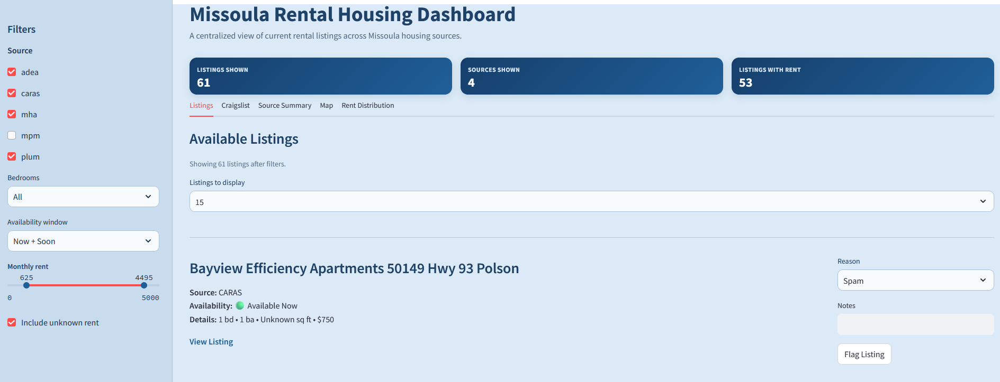
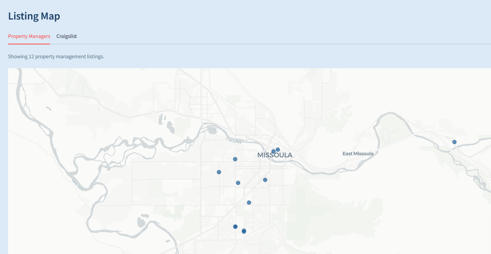
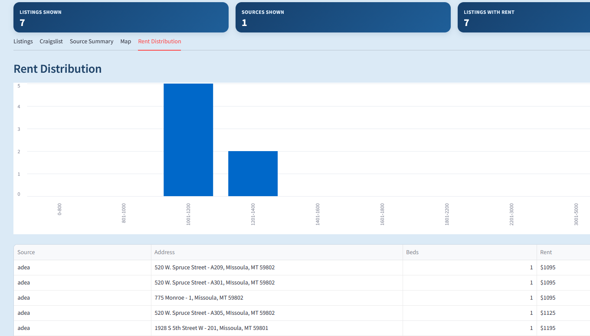

<h1 align="center">Affordable Housing Aggregator</h1>
<h3 align="center">Missoula, Montana</h3>

<p align="center">
  
</p>

<p align="center">
  <em>
    Project by Parker Munsey<br>
    University of Montana MSBA Capstone
  </em>
</p>

---

## Project Overview

Missoula has a limited and fragmented rental housing market, especially for affordable one-bedroom units. Rental listings are spread across multiple property management websites, PDFs, and independent platforms, making it difficult to understand what housing is actually available at any given time.

This project builds a centralized data pipeline and dashboard that aggregates rental listings from multiple sources into a single, queryable system. The goal is to provide a clear and up-to-date view of available housing options for renters, housing organizations, and local stakeholders.

---

## Repository Structure

- **[scripts/ingestion](scripts/ingestion/)**: Source-specific ETL pipelines that scrape and collect rental listing data from each provider.

- **[scripts/staging](scripts/staging/)**: Shared normalization logic that transforms raw data into a clean, standardized schema across all sources.

- **[scripts/database](scripts/database/)**: SQL and Python scripts for creating tables, schemas, and views used in the pipeline.

- **[scripts/dashboard](scripts/dashboard/)**: Streamlit dashboard application for exploring rental listings.

- **[docs](docs/)**: Project assets including images, diagrams, and documentation.

- **[deliverables](deliverables/)**: Final project outputs including reports and submission materials.

- **[README.md](README.md)**: Project overview, setup instructions, and documentation.

- **[three_ps_munsey](three_ps_munsey)**: Provides progress, problems, and plans updates on the project.

---

## Why This Project Matters

Currently, finding housing in Missoula requires manually checking multiple websites and documents. This process is time-consuming and often incomplete.

This project addresses that problem by:

- Centralizing rental listings across multiple sources  
- Standardizing inconsistent data into a unified format  
- Enabling real-time visibility into housing availability  

The result is a system that improves accessibility, transparency, and decision-making around housing.

---

## Data Sources

The pipeline currently integrates data from multiple sources:

- Missoula Property Management  
- Missoula Housing Authority (Vacancy PDF)  
- Caras Property Management  
- Plum Property Management  
- ADEA Property Management  
- Craigslist  

Each source has a different structure and level of data quality, requiring custom ingestion and normalization logic.

---

## System Architecture

The project follows a structured data engineering workflow:

**Raw → Staging → Views → Dashboard**

- **Raw Layer**  
  Stores append-only scraped data exactly as collected from each source  

- **Staging Layer**  
  Cleans and standardizes data into a consistent schema across all sources  

- **Views Layer**  
  Provides query-ready datasets for analysis and visualization  

- **Dashboard Layer**  
  Presents filtered and aggregated housing data to end users  

This modular design allows for scalable ingestion and easier debugging across sources.

---

## Data Pipeline

The system uses Python-based ETL pipelines to ingest and transform data:

- Each source has a dedicated ingestion script  
- Data is stored in a centralized PostgreSQL database (Supabase)  
- A shared normalization script standardizes all sources into a single staging table  
- Data is prepared for downstream analytics and dashboarding  

This approach ensures consistency while allowing flexibility for source-specific parsing.

---

## How to Run

### 1. Set up the environment (first time only)

From the project root:

```bash
python -m venv .venv
```

Activate the virtual environment (Windows PowerShell):

```bash
.\scripts\venv\Scripts\activate
```

Install dependencies:

```bash
pip install -r scripts/requirements.txt
```

---

### 2. Run the full data pipeline

Navigate to the `scripts` folder:

```bash
cd scripts
```

Activate the virtual environment (if not already active):

```bash
.\venv\Scripts\activate
```

Run the full pipeline:

```bash
python run_daily_pipeline.py
```

This will automatically:
- Run all ingestion scripts (ADEA, Caras, Craigslist, MHA, MPM, Plum)
- Normalize raw data into staging (`stg_listings`)
- Refresh the dashboard view (`dashboard_ready_listings`)

---

### 3. Launch the dashboard

From the same `scripts` folder:

```bash
streamlit run dashboard_app.py
```

Then open the URL shown in the terminal (typically):

```
http://localhost:8501
```

---

### Optional: Run everything with one click (Windows)

```
scripts/run_daily_pipeline.bat
```

This is the easiest option for non-technical users and is what should be scheduled for daily updates.

---

### Recommended Daily Workflow

1. Run the pipeline (or let the scheduled task handle it)
2. Open the dashboard in your browser
3. Review listings and optionally flag/remove incorrect or inactive ones

---

### Notes

- Flagging a listing does **not delete data**. It hides the listing from the dashboard using a backend moderation table (`listing_flags`).
- The dashboard always reflects the most recent pipeline run.
- If new data is ingested, previously flagged listings will remain hidden.

---
## Dashboard Preview

The Missoula Rental Dashboard is the final output of this project. It provides a centralized, interactive view of rental listings aggregated from multiple housing sources across Missoula.

The dashboard is designed to be simple for users while being powered by a structured data pipeline behind the scenes.

---

### Initial Dashboard View



The main dashboard displays current rental listings after cleaning and deduplication. Key features include:

- **Centralized listings** from multiple property management sources
- **Real-time filtering** by source, bedrooms, rent, and availability
- **Standardized listing data** (rent, beds, baths, square footage)
- **KPI summary cards** showing listings, sources, and rent coverage
- **Direct links** to original listing pages
- **Flag Listing feature** to hide incorrect or inactive listings

The goal of this view is to replace the need to check multiple websites by providing a single, reliable interface for exploring rental availability.

---

### Map View



The map view allows users to visualize listings geographically:

- Displays listings using latitude and longitude from normalized data
- Helps identify location patterns and neighborhood distribution
- Supports quick exploration of where available units are located

This adds spatial context to the listing data, which is not available on most individual property management sites.

---

### Rent Distribution View



The rent distribution view provides a simple analytical perspective:

- Shows how rental prices are distributed across listings
- Can be filtered by source to compare pricing across providers
- Helps identify pricing ranges and outliers

This view turns the dashboard from just a listing tool into a lightweight analysis tool.

---

### Key Feature: Flagging System

One of the most important features of the dashboard is the **flagging system**.

- Users can flag listings that are incorrect, inactive, or irrelevant
- The flagged listing is immediately removed from the dashboard
- The action is stored in a backend `listing_flags` table
- The original data remains intact (no destructive deletes)

> **Flagging does not erase data — it hides listings from the live dashboard.**

This allows users to improve dashboard quality in real time without requiring developer intervention, while preserving the integrity of the data pipeline.
### Data Processing
- Python  
- BeautifulSoup (HTML parsing)  
- pdfplumber (PDF parsing)  
- SQLAlchemy (database interaction)  

### Database
- PostgreSQL (Supabase)

### Development Tools
- python-dotenv (environment management)  
- Git / GitHub  

### Visualization
- Streamlit (current dashboard)  
- Looker Studio (planned)

---

## How It Works

1. Scrape rental listings from multiple sources  
2. Store raw data in `raw_listings` (append-only)  
3. Normalize data into `stg_listings` using shared logic  
4. Create views for filtering and aggregation  
5. Serve data through an interactive dashboard  

---

## Project Status

### Current Progress
- Multiple sources successfully integrated  
- Raw → Staging pipeline implemented  
- Data standardized into a shared schema  
- Cross-source querying enabled  
- Dashboard prototype developed  

### Next Steps
- Improve cross-source deduplication  
- Expand data coverage across additional sources  
- Enhance dashboard features and usability  
- Prepare system for long-term automation and handoff  

---

## Author

**Parker Munsey**  
University of Montana  
Master of Science in Business Analytics (MSBA)
